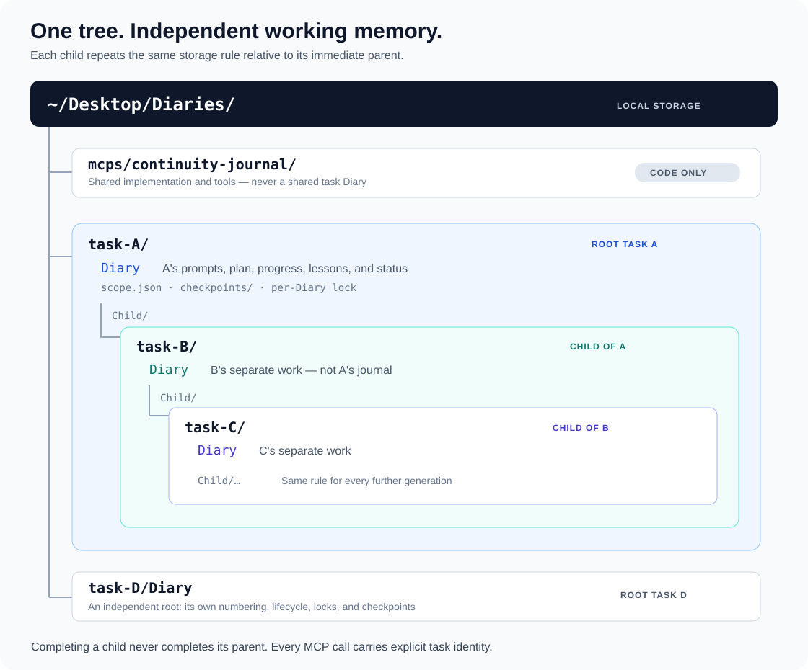

# Diary

### Persistent working memory for agents that cannot keep every conversation in context.

Diary is an **agent continuity framework**: a durable record of what was requested,
what has actually happened, what changed, and where the next execution should begin.
It combines an explicit operating protocol, a reusable skill, and a local MCP server.

[Set up Diary](SETUP_PROMPT.md) · [Operating skill](mcps/continuity-journal/skills/continuity-journal/SKILL.md) · [Runtime and tests](mcps/continuity-journal/README.md) · [Complete protocol](mcps/continuity-journal/references/CONTINUITY_PROTOCOL.md)

## The problem: a summary is not the work

Long-running agent tasks outlive their original context. A compressed handoff can
retain the broad objective while losing the details that determine the next correct
action: a rejected approach, a changed requirement, the identity of a child task,
or the fact that a migration has already finished.

The resulting failure is often not a lack of reasoning ability. It is reasoning
from incomplete state: repeating finished work, reviving a rejected plan, confusing
two tasks, or treating partial progress as completion.

Diary makes that state explicit and recoverable. It does not increase a model's
context window or make the model infallible. It gives the agent a record to consult
instead of asking its current conversation summary to carry the whole project.

## The design: externalize, isolate, recover

Diary separates three concerns:

1. **Durable working state.** Exact requests, plans, checkpoints, and lessons live
   in a local file rather than only in the conversation.
2. **Explicit ownership.** Every read or write names the current task. A child owns
   its own journal beneath its immediate parent's directory.
3. **Selective recovery.** The agent first receives compact active-work summaries,
   then explicitly expands a selected block when more detail is needed.

The important unit is not a chat message. It is a **numbered work block** with a
stable entry ID and a visible lifecycle. Related mid-task corrections stay in that
block; an explicitly resumed paused task gets a linked continuation at the bottom.

### Six fields that answer the next agent's questions

| Field | Question it answers |
| --- | --- |
| Identity and timestamp | Which task and work block is this? |
| Exact prompt | What did the user actually ask, including corrections? |
| Ordered plan | What is the current intended execution order? |
| Progress and checkpoints | What is verified, what remains, and where should work resume? |
| Journal and lessons | What was misunderstood, and what should not be repeated? |
| Lifecycle status | Is the work active, complete, cancelled, or explicitly paused? |

This is a structured journal, not an immutable event store. New blocks are appended,
while corrections, plans, and statuses can be atomically updated inside an existing
block. It is not a substitute for source control or backups.

## One tree, independent journals



```text
~/Desktop/Diaries/
├── mcps/continuity-journal/             Shared code, not shared task memory
├── task-A/
│   ├── Diary                           Root A's work
│   ├── scope.json                      Identity and lineage metadata
│   ├── checkpoints/ACTIVE_CHECKPOINT.md Optional compatibility checkpoint
│   └── Child/
│       └── task-B/
│           ├── Diary                   Child B's work
│           ├── scope.json
│           └── Child/
│               └── task-C/
│                   ├── Diary           Grandchild C's work
│                   ├── scope.json
│                   └── Child/…         The same rule repeats
└── task-D/
    └── Diary                           Independent root D's work
```

The illustrative names above stand for stable platform task/thread IDs, not display
titles. A child supplies **its own ID and its immediate parent's ID**. The resolver
finds the unique parent directory by name; the child does not need the entire
ancestor chain or the parent's journal contents.

Root, child, and grandchild can each have a block numbered `1`. Their entry IDs,
statuses, locks, and checkpoints are independent. Finishing C does not finish B or
A. Missing or ambiguous parents cause an error rather than a guess. The rule has
no configured nesting-depth limit, although filesystem limits still apply.

## How a task moves through the framework

**Start.** Before ordinary task work, one MCP call records the exact prompt, ordered
plan, timestamp, and working status.

**Progress.** Record meaningful milestones as they happen: decisions, evidence,
artifact locations, failures that change the plan, and the next concrete action.
Routine shell noise is not the journal's purpose.

**Correct.** A mid-task correction checkpoints the previous state, appends the exact
new prompt with a `+` separator, and optionally replaces the plan in the same block.
The previous request remains visible; the correction does not masquerade as an
unrelated new task.

**Pause and resume.** An explicit pause records the resume point and changes status.
Resuming creates a new bottom block with a new number and a link to the paused
source. The new resume prompt sits above the original prompt. Completing that
continuation also completes its linked source blocks in the same Diary.

**Recover.** After compaction, the agent resolves its own scope, selects the active
entry, and calls `continuity_resume`. It receives the plan, recent progress, and
compact prompt/journal excerpts, and records its next action. `diary_read` expands
one explicitly selected block when the summary is insufficient.

### Urgency and privacy are explicit

- A terminal **`(fast)`** means do the urgent work first and record afterward. The
  record still preserves whether this was a new task, an existing correction, or a
  paused-task resume. Interrupted unfinished work stays working.
- A terminal **`(nod)`** means do not journal that prompt or its result. Do not
  backfill it later or delegate around the exception. If both tags occur in the
  terminal tag area, `(nod)` wins.

These are instructions the agent must follow. The MCP can recognize supplied tags
and defer or skip relevant writes; it cannot intercept every host action or prevent
an agent from making an unrelated logging call with omitted context.

## What has actually been observed?

Diary was used while developing and migrating Diary itself. The local development
record contains a context-recovery checkpoint that restored the relocated runtime
path, the warning not to use a stale writer, the completed changes, and the remaining
documentation and deployment checks. That allowed the next execution to continue from the
recorded state rather than plan another migration.

The same development process recorded corrections to the design: moving away from
shared task records, requiring only an immediate parent ID for recursive lookup,
and preserving unfinished `(fast)` work as working. The useful outcome was a
recoverable explanation of **what changed and why**, rather than an unsupported
promise that the agent would remember the correction forever.

These are qualitative dogfooding observations, not a controlled memory benchmark.
Private journals are not included in this repository. We have not measured a model
recall percentage, a universal reduction in mistakes, or how frequently agents obey
the protocol without reminders.

### What the automated tests establish

The initial public release passed **136 tests on Python 3.11.9 and 3.14**: the
130-test baseline plus six public-packaging checks. An independent clean virtual
environment also passed the suite and exercised configuration and a real MCP
connection. These are local release results; GitHub Actions runs the suite again
on Linux. The test command is in the [runtime guide](mcps/continuity-journal/README.md).

| Verified behavior | Why it matters for continuity |
| --- | --- |
| Exact supplied prompt strings survive edits and selected reads, including CRLF, Unicode, and marker-like text. | The recorded requirement is not silently rewritten by serialization. |
| Corrections retain the old prompt, checkpoint first, and update the same block. | A later execution can recover the change of direction. |
| A selected active block can be recovered without returning paused or other-task bodies. | Handoffs expose relevant state without flooding the model with unrelated work. |
| Root, sibling, child, and grandchild operations keep separate paths and lifecycle state. | Concurrent tasks do not share a global active-block pointer. |
| Resume links propagate completion only within the selected Diary. | A finished child or unrelated block does not complete the parent task. |
| Fast deferral, posthoc correction/resume, and nod precedence are exercised. | Urgency does not require falsifying completion or discarding relationships. |
| Duplicate metadata, damaged framing, and prompt-hash mismatches reject mutations. | Corrupted state is surfaced instead of silently normalized into a new history. |
| Real stdio MCP calls and the connection bridge are exercised in temporary scopes. | Tests cover the transport boundary as well as direct persistence logic. |

These tests establish properties of the implementation. They do not prove that the
model's plan, interpretation, or journaled claims are correct.

## Technical architecture

**Protocol → skill → MCP → task-scoped storage.** The setup prompt installs the
rules and runtime. The skill teaches the agent when and how to invoke it. The
stateless MCP interface exposes 16 tools, each with explicit task identity.

- **Scoped routing:** parent discovery traverses canonical directory positions and
  metadata, not other task journal bodies. There is no server-global selected task.
- **Atomic local updates:** a per-Diary file lock protects read-modify-write and
  number allocation. Writes flush and `fsync` a temporary file before replacement.
  A short registry lock is used for initial identity registration, not shared work
  content. This is local file coordination, not a distributed transaction system.
- **Literal-safe fields:** length framing makes user text opaque to structural
  parsing, even when it contains strings resembling the framework's own markers.
- **Integrity checks:** prompt SHA-256, entry metadata, field lengths, and status
  consistency are checked before mutation. These detect inconsistencies; they are
  not cryptographic authentication against an actor who can rewrite both data and hash.
- **Bounded context expansion:** recovery returns compact excerpts and recent
  milestones, then permits a selected full-block read. The implementation still
  reads and validates the current Diary file; this is not an indexed database or
  a claim of sublinear disk I/O.
- **Runtime provenance:** `continuity_status` reports the executing source, version,
  Python interpreter, and effective configuration paths. A matching tool name alone
  does not establish that an old chat is connected to the new server.

The server has no network API calls or embedded model dependency. It uses the
MCP host's connection to return data to the calling agent.

## Install and operate

For agent-assisted installation, read [SETUP_PROMPT.md](SETUP_PROMPT.md). For exact
environment and command details, use the [runtime guide](mcps/continuity-journal/README.md).
The current implementation targets macOS/Linux POSIX environments. Windows needs
a compatible environment such as WSL or a separately tested native port.

Ship all three pieces:

| File | Audience and responsibility |
| --- | --- |
| `README.md` | People: understand the design, evidence, and tradeoffs. |
| `SETUP_PROMPT.md` | The installing agent: establish the environment and complete behavior contract. |
| `skills/continuity-journal/SKILL.md` | The operating agent: perform the recurring Diary routine. |

The skill is included inside the MCP package. Register it through the host's
supported skill/plugin installation mechanism; putting a file in an arbitrary
repository directory is not a universal auto-install mechanism. Its structure
follows the documented [SKILL.md format](https://learn.chatgpt.com/docs/build-skills).

The public guides and operating instructions are English. The original Korean
lifecycle tokens and existing disk-format labels remain compatibility identifiers:

| Stored status | Meaning |
| --- | --- |
| `작업 중` | Working |
| `작업 완료` | Complete |
| `작업 취소` | Cancelled |
| `작업 보류` | Paused |

Do not translate these tokens inside existing records or invent a fifth state.
User-authored prompts are always preserved in their original language.

## Boundaries worth knowing

- **A protocol is not an automatic host hook.** The agent must actually follow the
  durable instructions before/after work and after compaction. Unrecorded events
  cannot be reconstructed reliably from an empty journal.
- **Scope isolation is not caller authentication.** IDs prevent accidental routing
  mistakes, but a trusted local MCP caller can supply another registered ID. The
  framework is not a multi-tenant security boundary against hostile callers.
- **Local files can still be sensitive.** The MCP itself makes no network requests;
  returned content can enter a cloud agent's context. `(nod)` controls this framework's
  journal, not the host application's chat retention policy.
- **Recovery is selective, not magical.** The current API has no general full-history
  keyword-search endpoint. Retain entry IDs, block numbers, and handoff references.
  Do not invent a search tool or silently fall back to editing files by hand.
- **Compatibility is deliberate.** Do not let an old writer modify new length-framed
  records. Reconnect to the current MCP or use the bundled actual MCP client bridge.
- **Evidence remains the agent's responsibility.** A stored assertion is not a test
  result. Record paths and verification evidence, and check live state when needed.

Diary's practical promise is modest and useful: make the state required for
continuation explicit, inspectable, and recoverable. Better continuity comes from
using that state consistently—not from claiming the model can no longer forget.
