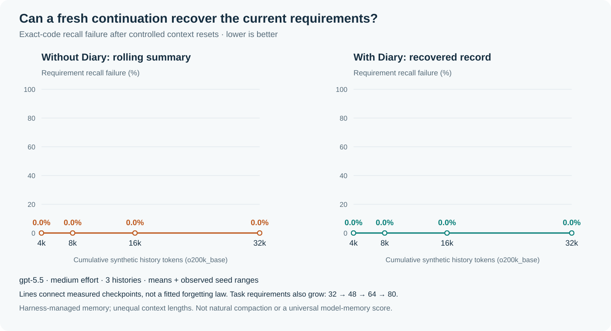
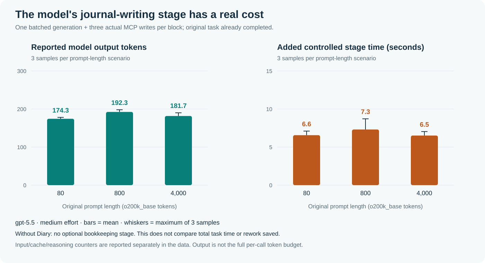
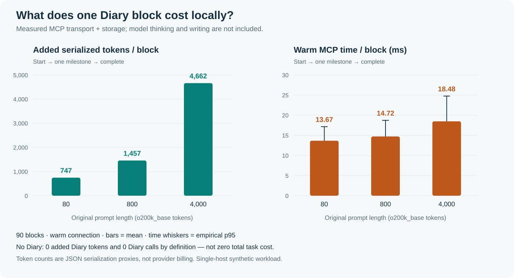

# Diary performance experiments

Diary trades explicit bookkeeping for recoverable task state. These experiments
separate that tradeoff into measurable parts instead of treating a local file write
as the full cost of an agent remembering something.

1. **MCP bookkeeping:** real transport, serialization, and local storage costs.
2. **Journal generation:** a real model converts a supplied completed-work trace
   into a concise record, followed by real MCP writes.
3. **Recall after controlled context resets:** fresh continuations receive either
   a rolling summary or an actual recovered Diary record.

Results apply to these fixtures and configurations. They do not establish a
universal forgetting curve, guaranteed instruction compliance, or a reduction in
total project time. Synthetic seeds control the data, not provider sampling.

## Measured results at a glance

The 2026-09-05 run completed **39 recall-model calls, 9 journal-writer calls, and
120 MCP-only blocks**. Route-discovery probes are recorded separately. The recall
pilot found **no advantage for Diary**: both arms had zero exact-requirement errors.
The experiment nevertheless measures the cost of retaining and exposing records.

### Recall after controlled resets



| Cumulative history tokens | Requirement checks per arm | Rolling-summary failures | Diary failures |
| ---: | ---: | ---: | ---: |
| 4,000 | 96 | 0 | 0 |
| 8,000 | 144 | 0 | 0 |
| 16,000 | 192 | 0 | 0 |
| 32,000 | 240 | 0 | 0 |
| **Total** | **672** | **0** | **0** |

Each point combines three histories. Requirements recur across checkpoints, so
672 checks are not 672 independent trials. The final histories contain 240 distinct
required codes across the three seeds. Latest corrections, obsolete-value reuse,
completed-action recall, proposed repetition, pending actions, and unknown-value
fabrication all had zero errors in both arms. Three full-history positive controls
passed 240/240 exact requirements.

The rolling-summary target was 2,048 estimated tokens, and no observed summary
exceeded it. Complete answers needed 552–1,399 estimated tokens, so the target did
not force facts to be discarded. Summaries were not clipped or tuned after seeing
results. The flat curves are an observation, not missing data.

The two representations had different costs:

| History tokens | Mean summary memory tokens | Mean Diary memory tokens | Mean summary probe time | Mean Diary probe time |
| ---: | ---: | ---: | ---: | ---: |
| 4,000 | 867.7 | 4,175.7 | 14.15 s | 14.54 s |
| 8,000 | 1,456.0 | 8,370.7 | 18.34 s | 19.58 s |
| 16,000 | 1,783.3 | 16,645.0 | 24.42 s | 37.34 s |
| 32,000 | 1,659.3 | 33,077.7 | 29.47 s | 50.06 s |

Memory sizes are `o200k_base` estimates for the supplied memory payload, not the
whole provider request. This Diary arm deliberately expands the selected full
block after compact recovery; it is not an optimized selective-retrieval study.
Its extra available history did not improve scores in this workload.

Summary maintenance is additional work and must not disappear from the comparison:

| Model-call category | Calls | Reported input tokens | Cached input tokens | Output tokens | Sum of call wall times |
| --- | ---: | ---: | ---: | ---: | ---: |
| Rolling-summary updates | 12 | 328,040 | 174,592 | 18,197 | 369.52 s |
| Summary continuations | 12 | 238,891 | 185,856 | 12,052 | 259.15 s |
| Diary continuations | 12 | 408,403 | 181,760 | 17,681 | 364.56 s |
| Full-history controls | 3 | 151,617 | 41,088 | 4,709 | 95.18 s |

Input counts include cached input, not an additional amount to add to it. Raw data
also retains separately reported reasoning counters; do not add them again to
output without establishing counter semantics. Call times are summed across three
concurrent seed sequences, not measured total elapsed experiment time. Diary
logging here was harness-managed, so this table is **not an end-to-end ROI test**.
Adding the separate writer-fixture cost would not make it one.

The [manifest](results/recall-20260905-gpt55/manifest.json),
[pre-generated fixtures and oracles](results/recall-20260905-gpt55/synthetic-fixtures-and-oracles.json),
and [results](results/recall-20260905-gpt55/results.json) are public. Individual call
files in that directory contain exact synthetic inputs, final responses, usage,
timing, and scores. A separate agent review recomputed all scores and checked hashes;
this is not an external laboratory replication.

### Real model journal-writing cost



| Original prompt tokens | Mean reported input | Mean cached input | Mean reported output | Mean model time | Mean complete stage time |
| ---: | ---: | ---: | ---: | ---: | ---: |
| 80 | 18,555.67 | 11,306.67 | 174.33 | 6.55 s | 6.56 s |
| 800 | 19,275.67 | 16,426.67 | 192.33 | 7.29 s | 7.31 s |
| 4,000 | 22,477.00 | 16,426.67 | 181.67 | 6.50 s | 6.51 s |

Three fresh-session samples per scenario produced nine records, all verified by
actual MCP read-back. These are scenario averages, not a distribution of real user
tasks. Input totals contain substantial CLI/system context and are **not the
Diary-only marginal input cost**. Without this optional bookkeeping stage, its
calls and costs are zero by definition; no underlying no-Diary task was timed.

The [writer result file](results/journal-generation-2026-09-05.json) includes exact
synthetic requests, generated records, usage/cache/reasoning counters, timings,
source hashes, and the breakdown of visible prompt components. Missing model
identity attestation is not replaced with a guess: the configured identifier and
CLI-resolved route evidence are distinguished from backend response metadata.

## Local MCP bookkeeping



On the measured macOS ARM64 host, the corrected run completed **120 blocks and
360 write calls**, plus read-back validation outside the timing window:

| Original prompt tokens | Warm mean / block | Warm p95 | Mean added serialization tokens | Fresh bridge mean / block |
| ---: | ---: | ---: | ---: | ---: |
| 80 | 13.67 ms | 17.16 ms | 747.43 | 1.70 s |
| 800 | 14.72 ms | 18.74 ms | 1,457.10 | 1.71 s |
| 4,000 | 18.48 ms | 24.76 ms | 4,662.30 | 1.72 s |

These are scenario means, not an average over real users' tasks. Raw numeric
samples, methodology, versions, and source hashes are in
[the MCP result file](results/mcp-overhead-2026-09-05.json). The reference bundle
totals **10,339 proxy tokens**: 4,223 tool-schema, 408 server-instruction, 4,044
protocol, and 1,664 skill tokens. Host caching and exposure differ; this is not a
per-block billed charge.

One block consists of `diary_start`, one `diary_progress_append`, and
`diary_set_status`. Synthetic original prompts contain 80, 800, or 4,000
`o200k_base` tokens. The plan and checkpoint content are fixed. Completed blocks
accumulate in a separate temporary Diary for each mode and scenario.

- **Warm connection:** 30 blocks per scenario on an already initialized MCP
  connection. Time covers the tool round trip and persistence, not tokenization.
- **Fresh bridge:** 10 blocks per scenario, starting a client and server for each
  tool call. This includes imports, initialization, schema listing, and shutdown.
  It is not the steady-state cost of a persistent MCP host connection.
- **Validation:** temporary runtime provenance is checked before writes. Selected
  reads verify the supplied prompt, plan, milestones, final progress, journal, and
  completed status. Read-back validation is outside the three-write timing.

Token estimates count compact JSON tool-call parameters plus SDK results. Actual
hosts expose different wrappers and may reuse cached input. These estimates are
**not billed tokens**, model reasoning, or the cost of solving the underlying task.
The original prompt is copied into the start call, so longer requests increase
bookkeeping even when the plan stays short.

Separate reference exposure comprises the tool schema, server instructions,
operating protocol, and skill text. It is not added once per block: the host's
prompt assembly, cache policy, and repeated recovery reads determine exposure.
Do not assume a large schema costs nothing simply because MCP execution is local.

## Controlled model experiments

The measured route is **`gpt-5.5`, medium reasoning effort, Codex CLI 0.142.3**.
An initial `gpt-6-astra` route did not yield a completed measurement; it is not the
model evaluated here. A successful CLI-default check and a separate model-header
check identified `gpt-5.5`; the experiments then pin that identifier explicitly.
This establishes the CLI-selected model, not independent backend attestation.

The model experiments use isolated, ephemeral, read-only Codex executions with
work tools, plugins, hooks, and project instructions disabled for both arms. Only
synthetic text enters the requests. The runner retains final responses, numeric
usage counters, and wall time, but not reasoning traces, account credentials,
provider thread IDs, or private filesystem paths.

The journal-generation stage is deliberately narrow: one batched model call
produces a plan, progress, final progress, and lesson from an already completed
synthetic trace. It does not perform the task or reproduce the natural timing of
three interleaved agent decisions. The host copies the exact original request;
the model does not need to generate that text again.

For the recall comparison, each generated history contains exact task constraints,
later corrections, completed actions, and clearly marked unrelated-task notes.
At checkpoints, the baseline model updates a rolling summary; a fresh continuation
answers structured probes using that summary. The Diary arm uses MCP-backed
records and selected recovery. Scoring requires exact current values rather than
keyword resemblance. Missing or wrong values count as requirement recall failures.

Important distinctions:

- The harness determines when context resets happen. This does not measure
  Codex's natural automatic-compaction behavior or its threshold.
- The harness manages logging and retrieval. This does not measure whether an
  autonomous agent follows the Diary protocol correctly.
- Recovered records and summaries need not have equal lengths. The comparison is
  system-level information availability, not equal-budget model intelligence.
- Completed-action repetition is scored from proposed actions, not actual repeated
  work. No claim about time saved from avoided work follows automatically.
- A zero-error baseline is a valid result. The experiment does not require an
  artificial decline or a Diary advantage to count as successful measurement.
- Required codes also grow from 32 to 48, 64, and 80 across checkpoints, alongside
  corrections and reset count. Any trend is a combined workload-history effect;
  token length alone is not isolated as a causal variable.

## Reproduce locally

From the repository root:

```sh
python3 -m venv .venv-bench
.venv-bench/bin/python -m pip install -r diary/benchmarks/requirements.txt
.venv-bench/bin/python -m unittest discover -s diary/benchmarks/tests -v
.venv-bench/bin/python diary/benchmarks/measure_mcp_overhead.py \
  --output /tmp/diary-mcp-overhead.json
.venv-bench/bin/python diary/benchmarks/render_results.py \
  --mcp /tmp/diary-mcp-overhead.json --output-dir /tmp/diary-benchmark-figures
```

`tiktoken` can download its public encoding asset on first use. MCP test records
are temporary and do not use an installed personal Diary configuration. Benchmark
unit tests never start paid model runs. Model experiments require an already
authenticated local Codex CLI and consume that account's usage; do not add account
credentials or model execution to public CI.

After verifying local CLI authentication and accepting the account-usage cost,
run the pinned model experiments explicitly. Use fresh output paths; existing
results are not silently overwritten or resumed:

```sh
.venv-bench/bin/python diary/benchmarks/measure_recall.py \
  --pilot --output /tmp/diary-model-route.json
.venv-bench/bin/python diary/benchmarks/measure_recall.py \
  --run --output /tmp/diary-recall-run
.venv-bench/bin/python diary/benchmarks/measure_journal_generation.py \
  --run --output /tmp/diary-writer-run.json
.venv-bench/bin/python diary/benchmarks/render_results.py \
  --recall-dir /tmp/diary-recall-run --writer /tmp/diary-writer-run.json \
  --output-dir /tmp/diary-benchmark-figures
```

The checked-in runner pins `gpt-5.5` / medium for the published experiment. A failed
route is a failure, not permission for an undocumented fallback. Run a separately
labeled experiment if using another model. The harness rejects unexpected model
tool actions and retains partial result files on failure, without automatic
retries. A completed-result check prevents the renderer from drawing missing model
observations as successes. Unit-test fixtures and mocked transport tests are never
included in the empirical result directory.

## Interpreting cost

Without Diary, **Diary-specific bookkeeping** is zero by definition. The underlying
task, conversation, compaction, and any repeated work still cost tokens and time.
The zero is therefore not an independently measured end-to-end task baseline.

Do not add serialization proxy tokens to provider usage counters: those are
different measurements and can overlap. Report provider input, cached input,
output, and reasoning counters as returned; an absent counter is unavailable, not
zero. A new journal-writing model call also contains fixed CLI/host instructions,
which must not be mislabeled as the Diary's marginal prompt alone.

A genuine break-even analysis requires measuring total work in both arms,
including native compaction, agent decisions, mistakes, recovery, and rework. The
current component experiments do not establish that break-even point.
